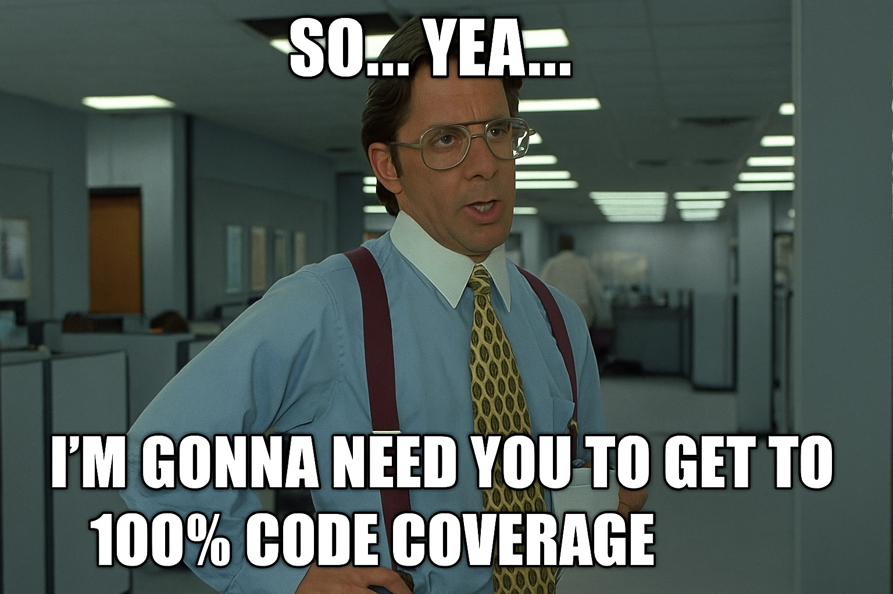
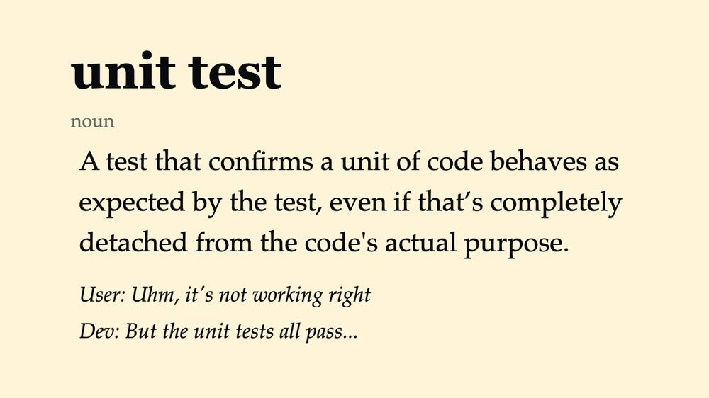
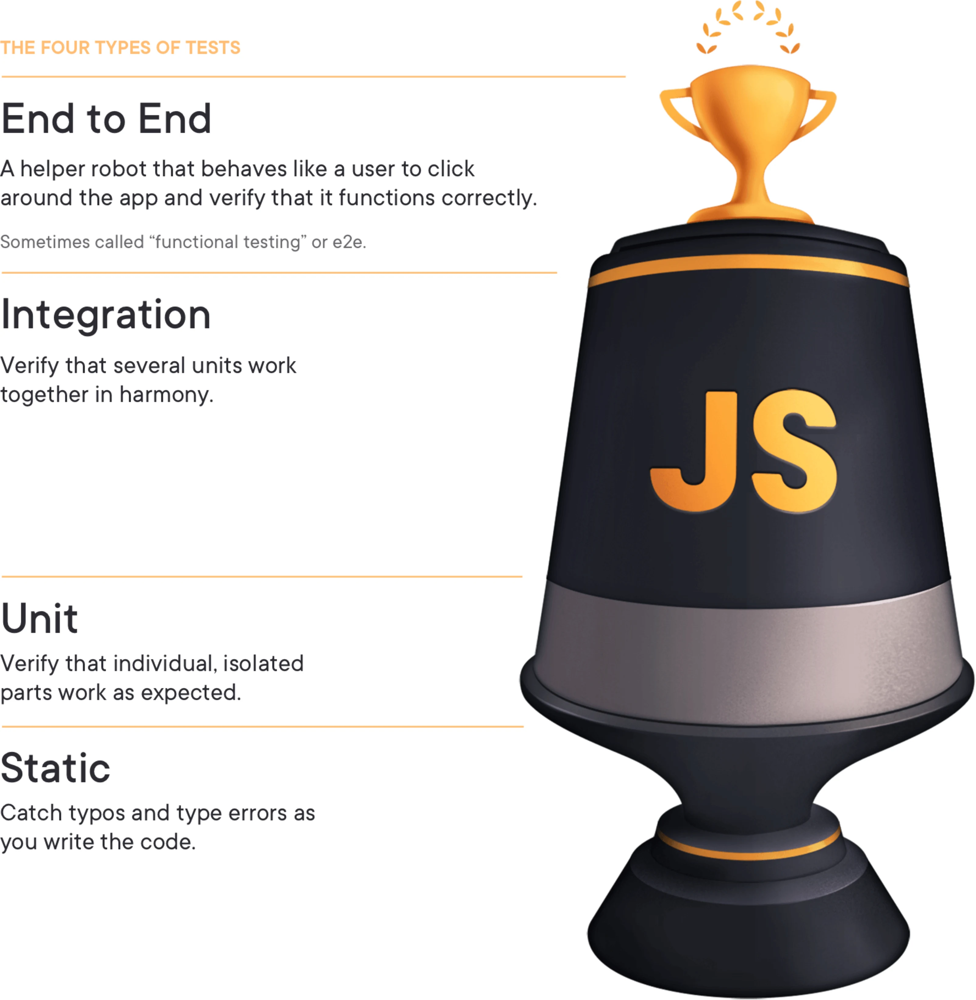

# The Web Dev's Guide to Automated Testing

---

# About Me

<!--
Fam: Married 16 years, 4 kids, 15, 14, 12, 10
Community is important.  JS Meet-up has been wonderful, community of people at church.
    - The title of this talk as actually inspired by something my Pastor said during a sermon.  Please don't tell him I day dream during his sermons.
Hobbies: Archery, Blood Bowl.
 -->

Personal Stuff:

- Meet the Fam!
- Community & Church
- Hobbies


---

# About Me: Professional Stuff

<!--
Education: I fully recognize that most of you care where I graduated from 20 years ago.  But I'm a proud Iowan! segways to experience
Experience: I've been a full stack developer for 20 years
Current Role: with Freewheel for almost 14 years.

Today I'm here to talk about testing.  Why talk about testing?
-->

- **Education:** 2004 Iowa State University Grad. w/ B.A. Info. Systems
- **Experience:** Nearly 20 Years as “Full-Stack” Developer
- **Current Role:** Lead Software Engineer @ FreeWheel

---

<!--
I often feel like the direction set for automated testing feels like this.

Tell brief narative about this

This is an over characterization, and maybe its not fair.  But it seems to be what happens.

It leads us to a place where we experience...
-->



---

<!--
Where we "game-ify" or work the system me meet a measurable Goal.

Charles Goodhart was a british economist credited with this adage as it relates to monetary policy.  We may not be talking about money, but the sentimet applies to many areas of life and I think often times to automated testing as well.

You see, when the metric becomes the expressed goal, it can lead to... undesireable results.

As an example a, focus on test coverage can lead to some thing like this
-->

# Goodhart's Law

> When a measure becomes a target, it ceases to be a good measure

---

<!--
Have a careful look at this.  Who knows what this does?

Yes, that's exactly right!  It tells the tooling... hey don't check for coverage in these places.  It excludes all of the key modules from our fictional business application!

Now.  Does this really help us?

Before anyone asks.... yes I have seen this happen in real life.  I have simplified the code block for clairity, and I did rename the packages to protect the identity of violators!

-->

```js
/* jest.config.js */
{
    collectCoverageFrom: [
        'packages/**/*.{js,jsx,ts,tsx}',
        '!**/packages/auth-module/**,'
        '!**/packages/billing-module/**',
        '!**/packages/core-business-logic/**',
        '!**/packages/data-repository/**',
        '!**/packages/insert-all-directories-here/**'
    ]
}
```

---

<!--
So my hope today, stop chasing vanity metrics.
we can move away from this as a definition.  With a mentatility similar to, "It works on my machine!"

So we can get away from chasing vanity metrics. Move to a place where we take a purposeful and principled approach to automated testing.

And as a first step I want to clear state what I think the intended purpose of testing is.

-->



---

<!--
It may seem obvious but the reason we writes tests is to ensure we have a high level of confidence that our software is working.

In the beginning our software may be very simple, and it may not need tests.  Some software never needs tests.
    - A hobby project
    - A very simple CLI tool that just one thing
    - A small web form that isn't business critical

But as our software becomes becomes more complicated, more valuable, more critical.
Testing becomes more important.
    - medical software that deals with life and well being
    - handling of peoples money and their livelihoods
    - Delivering critical communications (mail, email, phones, etc)

Most often in our day jobs we are building complicated, critical software.  So, when we talk to our teams about testing related topics, this is the filter through which we should be having those conversations.

In hopes of meeting this purpose I've got 4 principles to share with you today

-->

# Purpose of Testing

_To have a high level of confidence that our software is working as expected._

---

<!--
The principles are as follows.

We'll break these down as we move forward and include some common helpful practices

-->

# Principles for Creating an Effective Test Suite

1. Write tests that resemble how your software is used
2. Well written tests are essential documentation
3. Value Test Case Coverage over Code Coverage
4. Optimize for fastest possible developer feedback loop.

---

<!--
Since most of us are web developers here, any of the details we'll look at as we move forward, will be focus on the web.  But principle still holds true even if you're writing other forms of software.
-->

# Principle 1:

## Write tests that resemble how your software is used

---

<!--
To be honest, This principle is nearly a copy and paste from a tweet from Kent C. Dodds on Twitter several years ago. I found this while I was reviewing the `testing-library` documentation.

The idea really resonates with me.  As a person who works on the web, that what my team and I are testing is the USER EXPERIENCE, not the code itself.  For most cases, I want to test implementation details.  Testing implementation details can lead to testing things that don't matter to your users.

This can often time lead to tests failing when you refactor your code, even if the user's experience doesn't change.

Practically this means we should pay attention to how we're selecting and interact with elements.

Watch out for
-->

<blockquote class="twitter-tweet"><p lang="en" dir="ltr">The more your tests resemble the way your software is used, the more confidence they can give you.</p>&mdash; Kent C. Dodds ⚡ (@kentcdodds) <a href="https://twitter.com/kentcdodds/status/977018512689455106?ref_src=twsrc%5Etfw">March 23, 2018</a></blockquote>

---

<!--
I've seen a lot of tests written like this, where element are queried for by their css class name.  Avoid this.  Users don't search for css classes in when they use our web applications.

Tests written this way can be fragile. Imagine you need to need to refactor your code, maybe your team decides to switch to Tailwind.  Maybe you mis-spelled the class name.  Maybe you decided to give it a better name.  Once you change that class name.  All your tests fail.  The system still works as it should. The user experience didn't change.  But all of your tests fail.  Now you have a bunch of extra work to do.

Granted visual styles are certainly a part of the user experience.

If you need to perform visual regression testing, they you'll want to use a visual snapshot testing tool.  I'm not gonna dig into that today, but do know they exist.  So if you really need to have visual tests that confirm your button sizes are regressing, there are tools for that!

-->

# Avoid class selectors

```tsx
<Button submit class="primary">
  Sign Up!
</Button>
```

```tsx
describe('when user clicks the submit button') {
  it('should validate the form') {
    const button = document.querySelector('button.test-button');

    button.click();
    // assertions
  }
}
```

---

<!--
In the same way, avoid html attributes when testing...because like css classes, users don't open up dev tools to look at html attributes

And just like querying elements by class name, getting them by html attributes leads to brittle tests. Change the properties of that attribute, and all of your tests fail even if the system still functions and the user experience remains unchanged.

It's not 2017 any more, and we shouldn't write tests like this any more.
-->

# Avoid `data-test-*`

```tsx
<Button submit data-test-id="submit-button>Sign Up!</Button>
```

```tsx
describe('when user clicks the submit button') {
  it('should validate the form') {
    const button = document.querySelector('[data-test-id="submit"]');

    button.click();
    // assertions
  }
}
```

---

<!--
In 2018, testing-library was released.  Just use testing library!  Testing library is so good!  I'd go as far as to say, if you're not using testing library, then you're doing it wrong! It provides an amazing developer experience.

Out of the box it provides matchers that both solve the fragility problem I've highlighted and encourage you to write your test and implement your code in a way that is optimal for both the web platform and usability/accessibility.

Notice here, we function called `getByRole` that accepts the parameter 'button' and a name.  It will actually look at your DOM, and find the button that contains the text "Sign Up!".

So, this is mimicking the actual user experience!  Meaning, if your button text changes, and to be the text on the screen is part of the user's experience, the test will fail.  And will prompt you to either fix your test because the user experience changed, or fix the button text you changed on accident.

If you encounter cases where the testing library way of doing it isn't working, it's probably best to consider improving your implementation so that it uses the web platform and is accessible

In addition to the its excellent developer experience, testing library very strongly encourages you to write your web software in a way that is accessible to assistive technologies.  So, everybody wins!

To close this slide out again.... just use Testing Library!

-->

# Use `testing-library`

```tsx
<Button submit data-test-id="submit-button>Sign Up!</Button>
```

```tsx
describe('when user clicks the submit button') {
  it('should validate the form') {
    const button = screen.getByRole('button', { name: 'Sign Up!' });

    button.click();
    // assertions
  }
}
```

---

<!--
Principle 2: Well written tests are essential documentation.


Many will say, the code is the documentation.  And, you know what... that is totally true.  The code is the source of truth.  We can all agree that well written, clear, concise code is amazing.

In some ways this principle is an extension of the first.  We need to embrace the mindset that our tests confirm how our code is actually supposed to work.

-->

# Principle 2:

## Well written tests are essential documentation

---

<!--
Because I have reviewed that PR, code looks great... tests all pass.  Used the feature... yea... that's wrong.  Followed by that argument... sorry, conversation... with fellow developer...

You know, I don't think this is right.  But my code is clean, and all my tests pass ... BUT THAT's NOT WHAT IT'S SUPPOSED TO DO!

By treating our tests as essential documentation for how our system works, we can get out of this "Well it works on my machine mindset.

But how do we do that?

-->


---

<!--
Here are 5 questions that every effective test should cover.  I borrowed these from a guy name Eric Elliot.

Upon quick inspection these seem to make sense.  But I've seen tests that skip one or more of these.  Let's see some "fictitious" examples...  After all, I need to protect the identity of the not so innocent

--->

# 5 Questions Every Test Should Answer

1. What are you testing?
2. What should it do?
3. What was the output (actual behavior)?
4. What was the expected output (expected behavior)?
5. How can the test be reproduced?

---

<!--
Here imagine we have a directory with multiple modules... each contains a validator function.

If you very carefully read the test code, you can see what is being tested, but you cannot test in the tst output
-->

# Question 1: What are you testing?

```js
/* test.js */
it('should validate the input' => {
  const result = mailValidator('P. Sherman, 42 Wallaby Way');
  expect(result).toBe(true);
})

it('should validate the input' => {
  const result = phoneValidator('867-5309');
  expect(result).toBe(true);
})
```

```
/* Output */
PASS  ./test.js
  ✓ should validate the input (X ms)
  ✓ should validate the input (X ms)
```

---

<!--
Here, we have another bad example... the output does not expect what should actually happen
-->

# Question 2: What should it do?

```js
it('test the mail validator' => {
  const result = mailValidator('P. Sherman, 42 Wallaby Way');
  expect(result).toBe(true);
});
it('test the phone validator' => {
  const result = phoneValidator('867-5309');
  expect(result).toBe(true);
});

```

```
PASS  ./test.js
  ✓ test the validator (X ms)
  ✓ test the mail validator (X ms)
```

---

# Question 3 & 4: What is the actual and expected output


---
# Principle 2:

## Naming Conventions

---

# Principle 2

## Consider the console output

---

# Principle 2:

## Arrange Act Assert pattern

---

# Principle 3:

## Value Test Case Coverage over Code Coverage

---

# Principle 4

## Optimize for fastest possible developer feedback loop

- Automation!
- Processing on CI
- Fast runs locally
- Necessary refactoring/changes to keep them as fast as possible
- Sword fighting example.

---

<!--
Remember this old xkcd comic about compiling?

Yea it applied to testing too!
-->


---

<!--
- Each of these in very important
- Help us ensure quality
- Should be automated
  - Locally
  - CI jobs

later we'll get into some specific practices and patterns to help with Unit and Integration testing.

-->

# Types of Testing

_Testing Trophy, courtesy Kent C. Dodds_



---

# Conclusion

## The Purpose of Testing

_To have a high level of confidence that our software is working as expected._

## 4 Principles for Effective Testing

1. Write tests that resemble how your software is used
2. Well written tests are essential documentation
3. Value Test Case Coverage over Code Coverage
4. Optimize for fastest possible developer feedback loop.

---

# Thank you

---

# Resources:

- [What Every Unit Test Needs by Eric Elliot](https://medium.com/javascript-scene/what-every-unit-test-needs-f6cd34d9836d)
