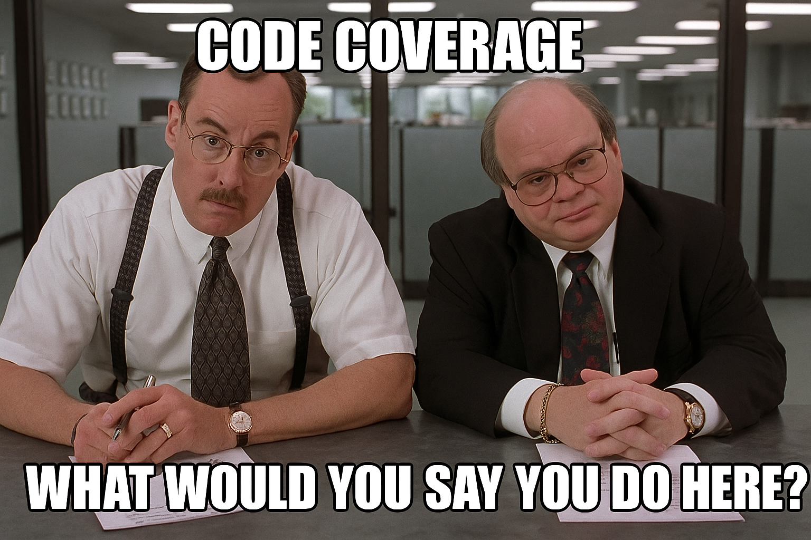

<!--
Thank Heather, and Jess, And Justin if he's there.
-->

# The Web Dev's Guide to Automated Testing

---

# About Me: Professional Stuff

<!--
Education: I fully recognize that most of you care.  But I'm a proud Iowan! segways to experience

Experience: I've experience doing full stack development

Current Role: with Freewheel for over 14 years.

Today I'm here to talk about the timeless topic of testing. I say timeless partly because as I prepared for this presentation I realized some of the most impactful things I've learn about effective tests, date back to 2005! 

And partly because the desire for quality software is timeless, and testing is an essential part of building quality software

Transition:  However, I feel like the direction set for automated testing feels like this.
-->

- **Education:** 2004 Iowa State University Grad. w/ B.S. Info. Systems
- **Experience:** Over 20 Years as “Full-Stack” Developer
- **Current Role:** Lead Software Engineer @ FreeWheel

---

<!--
Management/leadership come to a development team, put down a mandate... we need good quality software.  

To make sure we get good quality software, we need to make sure that 80%, or 90% of your code is covered by unit tests!
You've got 3 months to get there, go!

Is this over simplistic characterization?  Yea, and maybe its not fair. But it seems to be what happens. 

So, I'm gonna keep making bad office space memes to vent my frustration about code coverage 

Transition: I find that code coverage can quickly lead us to Goodhart's Law
-->


---

<!--
When a measure becomes the target, it ceases to be a good measure.

That is to say, it can lead to... undesirable results.

Transition: As an example focus on test coverage can lead to some thing like this...
-->

# Goodhart's Law

> When a measure becomes a target, it ceases to be a good measure

---

<!--
Have a careful look at this.  Who knows what this does?

Yes, that's exactly right!  It tells the tooling... hey don't check for coverage in these places.  It excludes all of the key modules from our fictional business application!

Now.  Does this really help us?

Before anyone asks... yes I have seen this happen in real life.  I have simplified the code block for clarity, and I did rename the packages to protect the identity of violators!

My hope is to move us from a place of chasing metrics.  To a place where we take a purposeful and principled approach to automated testing.

Transition: So let's start with a good definition...
-->

```js
/* jest.config.js */
{
    collectCoverageFrom: [
        'packages/**/*.{js,jsx,ts,tsx}',
        '!**/packages/auth-module/**,'
        '!**/packages/billing-module/**',
        '!**/packages/core-business-logic/**',
        '!**/packages/data-repository/**',
        '!**/packages/insert-all-directories-here/**'
    ]
}
```

---

<!--
I think our desired outcome is for automated testing is:

> to ensure we have a high level of confidence that our software is working.

Some may say this is obvious.  And I suppose it is.  But if based on my experience, its easy to loose sight of this.

In our day jobs we are often focus on the gnarly bits of our complicated, critical software.  We get distracted.

I think having a shared strong definition as our desired outcome should be the filter through which we should be having those conversations with our teams.

Transition:  I've got 4 principles to share with you.  That I've found if followed help meet our desire for confidence when we ship our software...

-->

# Desired Outcome of Automated Testing

_To have a high level of confidence that our software is working as expected._

---

<!--
The principles are as follows.
1. Write tests that resemble how your software is used

2. Well written tests are essential documentation

3. Code Coverage is a Leading Indicator of our Desired Outcome

4. Optimize for fastest possible developer feedback loop.

Transition: We'll break these down as we move forward and include some common helpful practices

-->

# Principles for Creating an Effective Test Suite

1. Write tests that resemble how your software is used
2. Well written tests are essential documentation
3. Code Coverage is a Leading Indicator of our Desired Outcome
4. Optimize for fastest possible developer feedback loop.

---

<!--
Since most of us are web developers here, many of the details we'll look at as we move forward, will be focus on the web.  

But principle still holds true even if you're writing other forms of software.

Transition: To be honest, This principle is nearly a copy and paste from a tweet from Kent C. Dodds on Twitter several years ago. I found this while I was reviewing the `testing-library` documentation.
-->

# Principle 1:

## Write tests that resemble how your software is used

---
<!-- _header: Principle 1: Write Tests that resemble how your software is used -->

<!--

The idea really resonates with me.  As a person who works on the web, what my team and I are testing is the USER EXPERIENCE, not the code itself.  

For most cases, we don't want to test implementation details only leads to two outcomes:

1. testing things that don't matter to your users.

2. Fragile tests 

This principle is in many ways philosophical. 
However it should deeply inform HOW we write our tests.

Practically this means we should pay attention to how we're selecting and interact with elements.

Transition: Let me demonstrate in web developer terms...
-->

<blockquote class="twitter-tweet"><p lang="en" dir="ltr">The more your tests resemble the way your software is used, the more confidence they can give you.</p>&mdash; Kent C. Dodds ⚡ (@kentcdodds) <a href="https://twitter.com/kentcdodds/status/977018512689455106?ref_src=twsrc%5Etfw">March 23, 2018</a></blockquote>

---

<!-- _header: Principle 1: Write Tests that resemble how your software is used -->
<!--
Over the years, I've seen a lot of tests written like this.

Element are queried for by their css class name.  

Avoid this.  Users don't search for css classes in when they use our web applications.

Tests written this way can be fragile.
- New framework, Tailwind 
- Maybe you mis-spelled the class name.  
- Maybe you decided to give it a better name.  

Once you change that class name.  All your tests fail.  

The system still works as it should. The user experience didn't change.  But all of your tests fail.  Now you have a bunch of extra work to do.

[Comments about visual testing]
- Necessary, but use visual snap shot testing

At the end of the day, css class names themselves are implementation details.

Transition: So testing with class name selectors.... not good.  Let's look at another practice to avoid...
-->

# Avoid class selectors

```tsx
<Button submit class="primary">
  Sign Up!
</Button>
```

```tsx
describe('when user clicks the submit button') {
  it('should validate the form') {
    const button = document.querySelector('button.test-button');

    button.click();
    // assertions
  }
}
```

---

<!-- _header: Principle 1: Write Tests that resemble how your software is used -->

<!--
So... we refactored our CSS at some point found that CSS class selectors lead to fragile tests.

So we thought... let's use a data attribute instead!  It's unique and doesn't need to change when we update our visual styles.

However, from a practical stand point, we run into the same underlying problem.  When we test using a data attribute we are testing are really testing an implementation detail.  A spelling mistake, or refactoring change leads to failing tests. 

Philosophically, It's not accurately testing the user experience.
Users don't open their dev tools to find an element with an attribute

Transition: It's not 2017 any more, and we shouldn't test our user experiences like this any more...
-->

# Avoid `data-test-*`

```tsx
<Button submit data-test-id="submit-button">Sign Up!</Button>
```

```tsx
describe('when user clicks the submit button') {
  it('should validate the form') {
    const button = document.querySelector('[data-test-id="submit"]');

    button.click();
    // assertions
  }
}
```

---

<!-- _header: Principle 1: Write Tests that resemble how your software is used -->
<!--
In 2018, testing-library was released.  Just use testing library!  Testing library is so good!  I'd go as far as to say, if you're not using testing library, then you're doing it wrong! It provides an amazing developer experience.

Out of the box it provides matchers that both solve the fragility problem I've highlighted and encourage you to write your test and implement your code in a way that is optimal for both the web platform and usability/accessibility.

Notice here, we function called `getByRole` that accepts the parameter 'button' and a name.  It will actually look at your DOM, and find the button that contains the text "Sign Up!".

This is mimicking the actual user experience!  Meaning, if your button text changes, and to be the text on the screen is part of the user's experience, the test will fail.  And will prompt you to either fix your test because the user experience changed, or fix the button text you changed on accident.

If you encounter cases where the testing library way of doing it isn't working, it's probably best to consider improving your implementation so that it uses the web platform and is accessible

In addition to the its excellent developer experience, testing library very strongly encourages you to write your web software in a way that is accessible to assistive technologies.  So, everybody wins!

Transition: To close out principle 1, If you are building for the web, just use Testing Library!

-->

# Use `testing-library`

```tsx
<Button submit data-test-id="submit-button>Sign Up!</Button>
```

```tsx
describe('when user clicks the submit button') {
  it('should validate the form') {
    const button = screen.getByRole('button', { name: 'Sign Up!' });

    button.click();
    // assertions
  }
}
```

---

<!--
Principle 2: Well written tests are essential documentation.


Many will say, the code is the documentation.  And, you know what... that is totally true.  The code is the source of truth.  We can all agree that well written, clear, concise code is amazing.

In some ways this principle is an extension of the first.  
We need to embrace the mindset that our automated tests confirm how our code is actually supposed to work.

Transition: Because I have reviewed that PR, code looks great... tests all pass.  Used the feature... yea... that's wrong.  Followed by that argument... sorry, conversation... with fellow developer... 
-->

# Principle 2:

## Well written tests are essential documentation

---
<!-- _header: Principle 2: Well written tests are essential documentation -->

<!--

You know, I don't think this is right.  But my code is clean, and all my tests pass ... BUT THAT's NOT WHAT IT'S SUPPOSED TO DO!

By treating our tests as essential documentation for how our system works, we can get out of this "Well it works on my machine mindset.

Transition: But how do we do that?

-->


---

<!-- _header: Principle 2: Well written tests are essential documentation -->
<!--
Here are 5 questions that every effective test should cover.  I borrowed these from a guy name Eric Elliot.

Upon quick inspection these seem to make sense.  But I've seen tests that skip one or more of these.  Let's see some "fictitious" examples...  After all, I need to protect the identity of the not so innocent

--->

# 5 Questions Every Test Should Answer

1. What are you testing?
2. What should it do?
3. What was the output (actual behavior)?
4. What was the expected output (expected behavior)?
5. How can the test be reproduced?

---

<!-- _header: Principle 2: Well written tests are essential documentation -->

<!--
Here imagine we have a directory with multiple modules... each contains a validator function.

If you very carefully read the test code, you can see what is being tested, but you cannot test in the test output

This isn't real helpful is it?

Transition: Lets look at the next example
-->

# Question 1: What are you testing?

```js
/* test.js */
it('should validate the input' => {
  const result = mailValidator('P. Sherman, 42 Wallaby Way');
  expect(result).toBe(true);
})

it('should validate the input' => {
  const result = phoneValidator('867-5309');
  expect(result).toBe(true);
})
```

```
/* Output */
PASS  ./test.js
  ✓ should validate the input (X ms)
  ✓ should validate the input (X ms)
```

---

<!-- _header: Principle 2: Well written tests are essential documentation -->
<!--
Question 2: What should it do? 

Here, we have another bad example... the output does not expect what should actually happen

Again, the test output... not helpful!

Transition:  Moving along to questions 3&4
-->


# Question 2: What should it do?

```js
it('test the mail validator' => {
  const result = mailValidator('P. Sherman, 42 Wallaby Way');
  expect(result).toBe(true);
});
it('test the phone validator' => {
  const result = phoneValidator('867-5309');
  expect(result).toBe(true);
});

```

```
PASS  ./test.js
  ✓ test the phone validator (X ms)
  ✓ test the mail validator (X ms)
```

---
<!-- _header: Principle 2: Well written tests are essential documentation -->

<!--
Question 3 & 4: What are the actual and expected outputs?

This example probably the worst thing you can do in a test.  

Who can spot the problem?

Yes!  There are no actual assertions. We wrote the test and passes.  Great!  However it doesn't actually test ANYTHING! So long as the code does throw an error... it passes!

Transition:  Make sure this doesn't happen in your tests...
-->
# Question 3 & 4: What is the actual and expected output

```js
describe('Mail Validator' => {
  describe('given address without zip code', () => {
    it('should be invalid', () => {
        const isValid = mailValidator(P. Sherman, 42 Wallaby Way);
    });
  });
});
```
```
PASS  ./test.js
  ✓ Mail Validator (X ms) 
    ✓ given address without zip code (X ms) 
        ✓ should be invalid (X ms) 
```
---

<!-- _header: Principle 2: Well written tests are essential documentation -->
<!--
This is a case where the test code itself should clearly and concisely tests to reproduce the test case and the results.  

To answer this question you have to actually read the test code and say, is this clear. 

If you cannot easily identity the answer to this question, start asking more questions

Now, some of you are nodding.  Some of you are cringing.  Many of us, myself included have made these mistakes.  It's OK. 

Just remember, for each and every one of these, its very easy to do better!

Transition: So let's talk about some practical tangible things we can do to to answer these questions and have well written tests that function as essential documentation.
-->

# Question 5: How can the test be reproduced? 

---

<!-- _header: Principle 2: Well written tests are essential documentation -->

<!--
Start with the end in mind

Ideally, we want our test output to read like a high quality report.  The test output itself is then clear documentation about what the functionality does.

Here, The bad example shows ambiguous unclear results.  It doesn't really answer, what is being tested.  It doesn't state what it should do, nothing about the inputs or expected outputs. 

After reading this, all you can conclude is that some tests ran.

Transition: A great way to improve the output is to simply start using some consistent naming conventions.

-->

# Start with the End in Mind

```sh
# Bad Output
PASS  ./test.js
  ✓ area code(X ms)  
  ✓ no area code(X ms)  
  ✓ not enough characters (X ms)  
  ✓ valid address (X ms)  
  ✓ no state(X ms)  
  ✓ city state zip (X ms)  
```

---

<!-- _header: Principle 2: Well written tests are essential documentation -->

<!--
Back when I was doing lots of testing in C# I stumbled across some very good naming conventions from Roy Osherove.

I've since had success adapting his conventions to JS frameworks like Jest and Vite.  It looks like this: 

[describe the item]

Transition: An actual implementation might look something like this...
-->

# Naming Conventions
```ts
/**
 * filename: [system-under-test].test.ts[x]
 * test fixture: system under test or file being tested
 * unit of work: often the function being tested
 * state under test: input parameters
 * expected result: actual output
 */
describe("test fixture", () => {
  describe("unit of work", () => {
    describe("state under test", () => {
      it("expected result", () => {
        // Test Code here
      });
    });
  });
});
```

---

<!--
[VERY Quickly read example]

Transition: This then yields much better results
-->
# Naming Conventions in Action

```ts
/** phoneValidator.test.ts */
describe('phoneValidator', () => {
  describe('given 7 digit US number with no area code' => {
    it('returns true', () => { /* test code */});
  });

  describe('given 7 digit US number with area code' => {
    it('returns true', () => { /* test code */});
  });

  describe('given US number with less than 7 digits' => {
    it('returns true', () => { /* test code */});
  });
});
```

---

<!--
Now checkout the test output.  Its organized by file.  By feature, and describes what it does.

Cool right?
So, you can see clear, concise, and consistent naming conventions alone can go along way towards and answering questions 1-4

Transition: Answering Question 5: How can the test be reproduced? Can be answered in test code by another pattern/convention
-->

# Better Output
```sh
# Good Output
PASS ./phone-validator.test.js
 ✓ Phone Validator (X ms) 
  ✓ given 7 digit US number with no area code (X ms)  
    ✓ returns true (X ms)  
  ✓ given 7 digit US number with area code (X ms)  
    ✓  returns true (X ms)  
  ✓ given US number with less than 7 digits (X ms)  
    ✓ returns false (X ms)  

PASS ./address-validator.test.js
 ✓ Address Validator (X ms) 
  ✓ given full address, city, state, and zip (X ms)  
    ✓ returns true (X ms)  
  ✓ given full address and city, but no state(X ms)  
    ✓ returns false (X ms)   
```

---

<!-- _header: Principle 2: Well written tests are essential documentation -->

<!--
The AAA pattern is something else I was introduced to back in my C# days.

A common pattern for consistently structuring tests.
When done properly, it clearly articulates the intent of the test

[VERY quickly read the descriptions]

Transition:  Here's a very contrived exampled of the Arrange Act Assert pattern practice
-->

# Meet the Arrange, Act, Assert Pattern

- **Arrange:** The requirements for the test.
- **Act:** upon the unit of work or system under test
- **Assert:** the expected output

---

<!--
Note this test demonstrates Principle 1: Tests should reflect the user experience
Using testing library.

You'll see here that I've actually stubbed out comments for the 3 sections.  I strongly suggest you do the same.  These comments how intend is declared.  They help you think through you test and declare intent.  

On more than one occasion this pattern has saved myself and the team.  After reading them test it lead to one of those conversations... is this REALLY what the UX is ?  

transition: Thus ends my commentary on principle 2: 
-->

# Arrange, Act, Assert in Action

```ts
describe('Sign Up Form' => {
  describe('when user inputs invalid phone number', () => {
    it('should disable the sign up button', async () => {
      // Arrange
      /** other test setup steps  */
      const phoneInput = screen.getByLabel('Phone Number');

      // Act
      await userEvent.change(phoneInput, 'Not a number');

      // Assert
      expect(await screen.findByRole('button', { name: 'Sign Up' })).toBeDisabled();
    })
  })
});
```
---

<!-- _header: Principle 2: Well written tests are essential documentation -->
<!--

When done right, tests aren't just a safety net. The test code and output serve as documentation for what our code is supposed to do. 

The console output serves as a good report of what the system does

The test code itself highlights how the code is used.

Transition: Let's move on to Principle 3
-->

## </ Principle2>

---

<!--
Principle 3: Code Coverage is a Leading Indicator of our Desired Outcome

Just to restate it again...

> To have a high level of confidence that our software is working as expected

Transition: If you have automated testing, but low confidence when you release...
--->

# Principle 3:

## Code Coverage is a Leading Indicator of our Desired Outcome

> _To have a high level of confidence that our software is working as expected._

---

<!-- _header: Principle 3: Code Coverage is a leading Indicator for our desired outcome -->
<!--
You should... question things.  

Transition: It might seem like I'm picking on code coverage.  And... well I sort of am.

-->



---
<!-- _header: Principle 3: Code Coverage is a leading Indicator for our desired outcome -->
<!-- 
But only because often times we treat it like a vanity metric.  
The metric can easily become the master,

Transition:  when in reality, code coverage...
-->


---
<!-- _header: Principle 3: Code Coverage is a leading Indicator for our desired outcome -->
<!--
is just be a tool.  

With a singular purpose, to reveal where you should not have high confidence your system is working as expected.

Transition: It's job is to be a lense into area's of your code and how it's being tested. 
-->

<!-- _header: Principle 3: Code Coverage is a leading Indicator for our desired outcome -->
# Code Coverage is a Tool


---

<!-- _header: Principle 3: Code Coverage is a leading Indicator for our desired outcome -->
<!--
Here's a totally fictitious example of a coverage report.  

As you daily drive your code, write tests, etc.
Drill in, notice that there is a code branch which isn't covered in module 1.  Let me have a look at that!  

Maybe your making changes to some components, drill into the report, see whats happening. 

Maybe you can add some missing test cases for the one your working on so you can increase confidence that you're software is working.

Remember, its a tool to help you, to improve your developer workflow.

Transition: Which ties closely principle 4

-->


---
<!--
If The desired goal of testing in general is to give us confidence that our software works.

Then the desired goal of automated testing is to improve the developer workflow by improving the feedback loop. Speeding up the feedback loop.

As you enhance the system.  As you fix bugs. Confirming that our software is working is working as expected.

Transition: Automated tests are a tool.  And we need to invest in our tools.

-->
# Principle 4

## Optimize for fastest possible developer feedback loop

---

<!--
Remember this old xkcd comic about compiling?
Over the years I've found it applied to testing too!

So if you feel you start stuck waiting on tests to run. 
Invest in using the tool well

Maybe that means running the tests locally before pushing them into a CI process.

Maybe it means upgrading your tooling to newer more performant tools
Maybe that means refactoring the tests so they execute faster AND still give you the desired confidence your software is working.

The point is, your automated tests are a tool.  Sharpen them as necessary to make sure you and your teams are as efficient and effective.


Transition: So, to put a bow on this... 
-->


---
<!--


-->
# Conclusion

## The Desired Outcome of Automated Testing is to

_To have a high level of confidence that our software is working as expected._

## 4 Principles for Effective Testing

1. Write tests that resemble how your software is used
2. Well written tests are essential documentation
3. Use Code Coverage as a Leading Indicator of our Desired Outcome
4. Optimize for fastest possible developer feedback loop.

---

<!--
Here are links to the slides and my linked in if you want to connect there.

Any questions?

Thank you for listening.  I hope you've found my pontifications on testing to be helpful.

Thanks to Heather and Jess for making this time and space available.

Thanks to the Issac this month, for Nieky, Ken, and all of you who've presented in the past.  I always come away with something useful.  

** Pitch for next month. **
I know Heather has speakers lined up for June and July.  
Still looking for August. Let me encourage you to help each of us get a little better by sharing your experience.
-->

# Questions?

<div class='flex'>

  
  ## _Slides_
</div>

---

# Resources:

- [What Every Unit Test Needs by Eric Elliot](https://medium.com/javascript-scene/what-every-unit-test-needs-f6cd34d9836d)
- [Naming Standards for Unit Tests by Roy Osherove](https://osherove.com/blog/2005/4/3/naming-standards-for-unit-tests.html)
